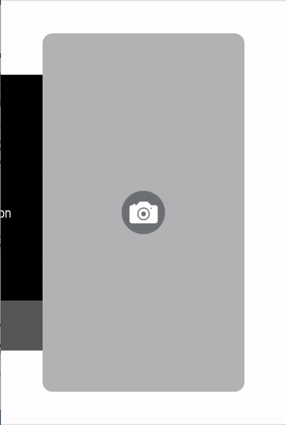

# VisualTouch

Makes iOS touch events visual.

## Installation

CocoaPods

	pod 'VisualTouch', :git => 'https://github.com/donpark/VisualTouch.git'

## Integration

Add `VisualTouch.swift` to your project then replace `window` instance variable declaration in `AppDelegate.swift` file:

    var window: UIWindow?
    
with:

    var window: UIWindow? = VisualTouch.Window(frame: UIScreen.main.bounds)

## Usage

To make touch events visible:

    VisualTouch.enable()

To disable:

    VisualTouch.disable()
